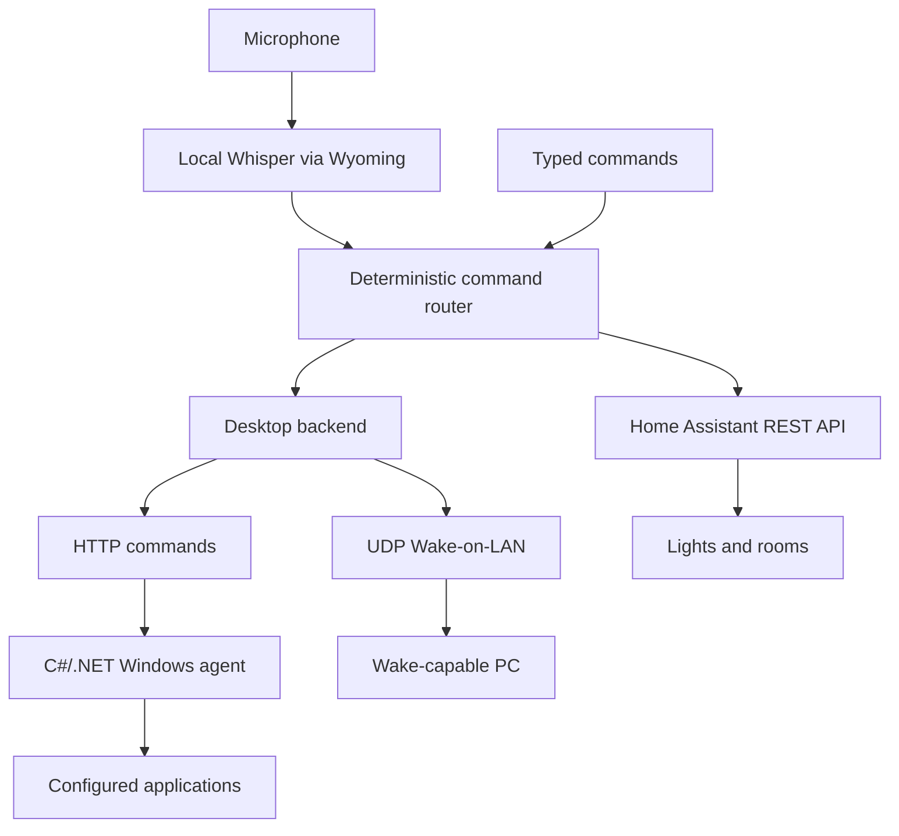

# Athena

Athena is a Python personal assistant hosted on a Raspberry Pi 5. It processes speech locally and routes supported commands to Home Assistant for lighting control or to a C#/.NET Windows desktop agent for application launching. It can also send Wake-on-LAN packets without the desktop agent running.

## Architecture



The Raspberry Pi handles recording, transcription, and routing. Home Assistant executes lighting actions. [Athena Desktop](https://github.com/b-stha/athena-desktop) receives structured HTTP commands, dispatches supported actions, and returns results. Its current application mapping supports Notepad.

## Current Features

- Local Whisper transcription through Wyoming, with Space to start and stop microphone recording and a 30-second recording limit.
- A terminal loop that displays transcripts and results or errors. Typed commands remain available with `--text`.
- Deterministic lighting commands for Nanoleaf desk lights (`nanoleafs`), Govee Table Glow and Under Glow, the Bedroom area, and grouped Philips Hue bathroom lights.
- Desktop application launching over HTTP, with generated request IDs, response validation, a five-second timeout, and no automatic retries.
- Wake-on-LAN through a UDP magic packet; sending a packet does not confirm PC startup.
- Automated tests for routing, desktop transport, Wake-on-LAN, recording controls, transcription, and error handling.

Example commands:

- `turn on nanoleafs`
- `turn off table glow`
- `turn on under glow`
- `turn off bedroom lights`
- `turn on bathroom lights`
- `open notepad`
- `turn on my pc`

## Running

Install the Python requirements and configure the required services before starting Athena:

```bash
.venv/bin/python -m pip install -r requirements.txt
./run.sh
./run.sh --text
```

See [voice setup](voice/README.md) for microphone and Whisper requirements, and [desktop integration](integrations/README.md) for HTTP and Wake-on-LAN configuration. Home Assistant uses `HA_URL` and `HA_TOKEN` from `.env`.

Run automated checks with:

```bash
.venv/bin/python -m unittest discover -s tests
```

## Planned Features

Fuzzy speech matching and shutdown routing are under review. Brightness commands, scenes, desktop window management, and LLM fallback remain planned additions. The current voice path uses deterministic routing, not an LLM.

## Stack

- Python, Raspberry Pi 5
- Home Assistant REST API
- Local Whisper through Wyoming, Docker
- HTTP/JSON and UDP Wake-on-LAN
- Companion Windows agent: C#/.NET
