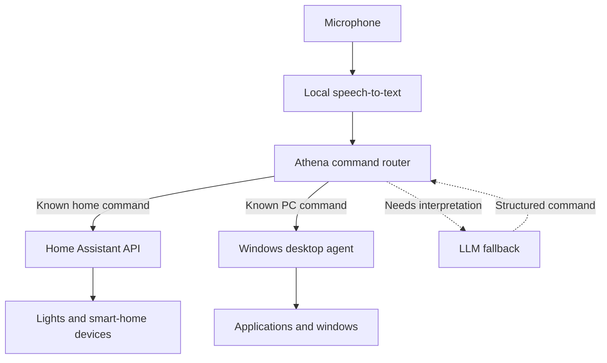

# Athena

Athena is a personal assistant hosted on a Raspberry Pi 5, designed to bring smart-home and Windows PC control into one voice interface. The goal is to handle requests ranging from turning on lights to waking a PC, launching applications, and arranging windows.

## Architecture

Athena is designed to process speech locally and route commands to either Home Assistant or a custom Windows desktop agent. Known commands use deterministic routing, with a planned LLM fallback for requests that need interpretation.

This diagram represents the intended architecture. The current implementation covers the basic command router and Home Assistant API integration.

- **Raspberry Pi:** Hosts Athena and local speech processing, remaining available while the PC is off.
- **Home Assistant:** Handles smart-home devices and automations.
- **Windows desktop agent:** Will execute PC-specific actions.
- **LLM fallback:** Will interpret more complex requests before passing them back through the router.

## Current Progress

The current implementation includes:

- Local Whisper transcription through Wyoming, with Space to start and stop microphone recording and a 30-second recording limit.
- A terminal loop that displays the transcript, passes it to the router, and reports results or errors. Typed commands remain available with `--text`.
- Deterministic `turn on` and `turn off` actions with separate device aliases, allowing variations such as `desk light` and `desks lights` while keeping action matching exact.
- Home Assistant service calls targeting individual lights or an area.
- On/off command mappings for Nanoleaf desk lights, Govee Table Glow and Under Glow, all bedroom lights through the Bedroom area, and the grouped Philips Hue bathroom lights. Individual bathroom bulbs are not exposed as command targets.
- Automated tests covering routing, recording controls, terminal cleanup, transcription messages, and error handling.

Example commands include `turn on desk lights`, `turn off table glow`, `turn on under glow`, `turn off bedroom lights`, and `turn on bathroom lights`.

Voice transcription and Nanoleaf on/off control have been tested live. The Govee entity-to-device mapping still needs verification after Table Glow and Under Glow were reported to control the same physical device.

Brightness commands, scenes, the Windows desktop agent, and LLM fallback remain planned additions.

## Stack

- Python
- Raspberry Pi 5
- Home Assistant
- REST APIs / HTTP
- Docker

Planned voice processing uses local Whisper through Wyoming, keeping speech recognition on the Raspberry Pi.
