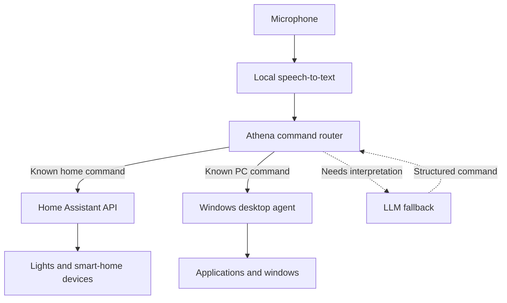

# Athena

Athena is a personal assistant hosted on a Raspberry Pi 5, designed to bring smart-home and Windows PC control into one voice interface. The goal is to handle requests ranging from turning on lights to waking a PC, launching applications, and arranging windows.

## Architecture

Athena is designed to process speech locally and route commands to either Home Assistant or a custom Windows desktop agent. Known commands use deterministic routing, with a planned LLM fallback for requests that need interpretation.

This diagram represents the intended architecture. The current implementation covers the basic command router and Home Assistant API integration.

- **Raspberry Pi:** Hosts Athena and local speech processing, remaining available while the PC is off.
- **Home Assistant:** Handles smart-home devices and automations.
- **Windows desktop agent:** Will execute PC-specific actions.
- **LLM fallback:** Will interpret more complex requests before passing them back through the router.

## Current Progress

The initial implementation includes:

- `home_assistant.py` — makes Home Assistant API service calls.
- `router.py` — routes a basic supported text command to the appropriate action.
- A simple main function connecting command input to the router.

The current flow supports a command such as `turn on desk lights`, routed to Home Assistant to control the configured light entity.

Voice input, broader command support, the Windows desktop agent, and LLM fallback are planned additions.

## Stack

- Python
- Raspberry Pi 5
- Home Assistant
- REST APIs / HTTP
- Docker

Planned voice processing uses local Whisper through Wyoming, keeping speech recognition on the Raspberry Pi.
