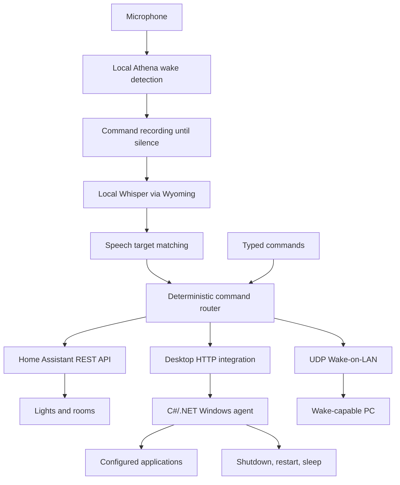

# Athena

Athena is a Python personal assistant hosted on a Raspberry Pi 5. It processes speech locally and routes supported commands to Home Assistant for lighting control or to a C#/.NET Windows desktop agent for application launching and power commands. It can also send Wake-on-LAN packets without the desktop agent running.

## Architecture


```mermaid
flowchart TD
    Mic["Microphone"] --> Wake["Local Athena wake detection"]
    Wake --> Capture["Command recording until silence"]
    Capture --> STT["Local Whisper via Wyoming"]
    STT --> Resolver["Speech target matching"]
    Resolver --> Router["Deterministic command router"]
    Text["Typed commands"] --> Router
    Router --> HA["Home Assistant REST API"]
    Router --> HTTP["Desktop HTTP integration"]
    Router --> WOL["UDP Wake-on-LAN"]
    HA --> Lights["Lights and rooms"]
    HTTP --> Desktop["C#/.NET Windows agent"]
    Desktop --> Apps["Configured applications"]
    Desktop --> Power["Shutdown, restart, sleep"]
    WOL --> PC["Wake-capable PC"]
```

The Raspberry Pi handles recording, transcription, speech target matching, and routing. Home Assistant executes lighting actions. [Athena Desktop](https://github.com/b-stha/athena-desktop) receives structured HTTP commands, dispatches supported actions, and returns results. Its current application mapping supports Notepad.

## Current Features

- Local wake-word activation for `Athena` through Wyoming openWakeWord, requiring a custom model trained for that single word. Commands stop after silence and have a 30-second limit. `--manual` retains Space-controlled recording.
- A terminal loop that displays transcripts, matched commands, and results or errors. Typed commands remain available with `--text`.
- Speech target matching using RapidFuzz Levenshtein distance, with exact action phrases and rejection of distant or ambiguous target matches. Text mode bypasses speech correction.
- Deterministic lighting commands for Nanoleaf desk lights (`nanoleafs`), Govee Table Glow and Under Glow, the Bedroom area, and grouped Philips Hue bathroom lights.
- Desktop application launching over HTTP, with generated request IDs, response validation, a five-second timeout, and no automatic retries.
- Wake-on-LAN through a UDP magic packet; sending a packet does not confirm PC startup.
- Core-side shutdown, restart, and sleep command routing and transport. Execution requires the corresponding desktop handlers; acknowledgment does not confirm completion of the power action.
- Automated tests for routing, desktop transport, Wake-on-LAN, power commands, speech matching, wake activation, speech endpointing, recording controls, transcription, and error handling.

Example commands:

- `turn on nanoleafs`
- `turn off table glow`
- `turn on under glow`
- `turn off bedroom lights`
- `turn on bathroom lights`
- `open notepad`
- `turn on my pc`
- `shutdown pc`
- `restart my pc`
- `sleep pc`

## Running

Install the Python requirements and configure the required services before starting Athena:

```bash
.venv/bin/python -m pip install -r requirements.txt
./run.sh
./run.sh --text
```

See [voice setup](voice/README.md) for the custom `Athena` wake model, wake service,
microphone and Whisper requirements, and [desktop integration](integrations/README.md)
for HTTP, Wake-on-LAN, and power-command configuration. Home Assistant uses `HA_URL`
and `HA_TOKEN` from `.env`.

Run automated checks with:

```bash
.venv/bin/python -m unittest discover -s tests
```

## Planned Features

Brightness commands, scenes, desktop window management, and LLM fallback remain planned additions. The current voice path uses deterministic routing and bounded speech matching, not an LLM.

## Stack

- Python, Raspberry Pi 5
- Home Assistant REST API
- Local Whisper through Wyoming, Docker
- Local openWakeWord through Wyoming, WebRTC VAD
- RapidFuzz
- HTTP/JSON and UDP Wake-on-LAN
- Companion Windows agent: C#/.NET
