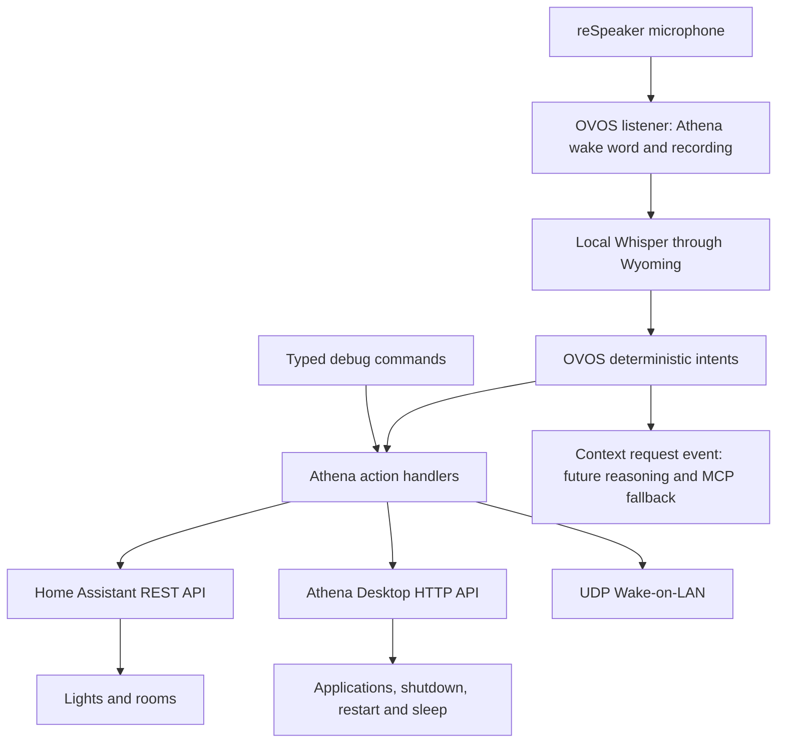

# Athena

Athena is a personal assistant hosted on a Raspberry Pi 5. OpenVoiceOS (OVOS)
manages microphone input, wake detection, command recording, transcription and
intent matching. Athena's handlers send home-device actions to Home Assistant
and desktop actions to the companion C#/.NET Windows client.

## Architecture


```mermaid
flowchart TD
    Mic["reSpeaker microphone"] --> Listener["OVOS listener: Athena wake word and recording"]
    Listener --> Whisper["Local Whisper through Wyoming"]
    Whisper --> Intents["OVOS deterministic intents"]
    Intents --> Handlers["Athena action handlers"]
    Intents --> Context["Context request event: future reasoning and MCP fallback"]
    Text["Typed debug commands"] --> Handlers
    Handlers --> HA["Home Assistant REST API"]
    Handlers --> Desktop["Athena Desktop HTTP API"]
    Handlers --> WOL["UDP Wake-on-LAN"]
    HA --> Home["Lights and rooms"]
    Desktop --> Windows["Applications, shutdown, restart and sleep"]
```

OVOS owns the voice pipeline and intent dispatch. Whisper remains the local STT
engine; an Athena plugin connects OVOS to the existing Wyoming server. Athena's
microphone plugin supplies the processed second channel of the reSpeaker Flex
XVF3800. OVOS then handles wake detection and speech endpointing.

[Athena Desktop](https://github.com/b-stha/athena-desktop) remains a separate
Windows app. Home Assistant and desktop integrations retain their existing
transports and result validation.

## Current features

- Single-word `Athena` wake detection using an existing Precise ONNX model.
  Setup downloads the model; training a custom openWakeWord model is unnecessary.
- Automatic command recording, with a 0.8-second silence boundary, a five-second
  wait for speech and a 30-second recording limit.
- Deterministic intent handlers for lights, desktop applications and PC power
  actions, with target validation before execution.
- Home Assistant commands for Nanoleaf desk lights, Govee Table Glow and Under
  Glow, the Bedroom area and Philips Hue bathroom lights.
- Desktop HTTP commands with generated request IDs, response validation, a
  five-second timeout and no automatic retries.
- Wake-on-LAN through a UDP magic packet, without requiring the desktop app to
  be running. Packet delivery does not confirm PC startup.
- `--text` mode for debugging commands without a microphone or OVOS services.

Examples after saying `Athena`:

```text
turn on nanoleafs
turn off table glow
turn on under glow
turn off bedroom lights
turn on bathroom lights
open notepad
turn on my pc
shutdown pc
restart my pc
sleep pc
```

The first OVOS integration prints transcripts and acknowledgments in the terminal
and records service logs. Spoken acknowledgments
and a TTS service are not configured yet. A successful power-command response
confirms acceptance by the desktop client, not completion of the Windows action.

## Setup and running

Run on the Pi with its microphone attached, using this branch of the repository:

```bash
sudo apt-get install python3-venv libportaudio2
python3 -m venv .venv
.venv/bin/python -m pip install -r requirements.txt
.venv/bin/python -m pip install -e .
.venv/bin/python -m athena_ovos.setup
```

Configure `.env` with `HA_URL` and `HA_TOKEN` for Home Assistant and `DESKTOP_URL`
for the Windows client. Keep the existing Wyoming Whisper service running on
`tcp://127.0.0.1:10300`, or set `WHISPER_URI` to its address.

Validate configuration and model loading, then start the voice frontend:

```bash
./run.sh --check-config
./run.sh
```

The configuration check does not open the microphone or execute commands.
Athena stores generated OVOS configuration, model files, logs and caches under
the ignored `.ovos` directory. Ctrl-C stops the frontend and its OVOS services.

Typed debugging remains available:

```bash
./run.sh --text
```

See [voice setup](voice/README.md) for microphone, model and listener details and
[desktop integration](integrations/README.md) for HTTP, Wake-on-LAN and power
configuration. The previous Space-controlled recorder is replaced by OVOS.

Run automated checks after installing the package:

```bash
.venv/bin/python -m unittest discover -s tests
```

Tests use fake microphone frames and backend actions. They verify integration
contracts and command handling; live wake-word accuracy with your microphone
still needs to be tested.

## Planned features

Unmatched requests can reach the `athena.context.request` message-bus event for a
future contextual reasoning and MCP consumer. That consumer is not implemented
yet. The intended architecture remains deterministic commands first, followed by
contextual reasoning when the request needs it.

Brightness commands, scenes, desktop window management and spoken responses
remain planned additions.

## Stack

- Python and Raspberry Pi 5
- OVOS core, message bus, Dinkum listener and intent handlers
- Precise ONNX wake detection and WebRTC VAD
- Local Whisper through Wyoming and Docker
- Home Assistant REST API
- HTTP/JSON and UDP Wake-on-LAN
- Companion Windows app: C#/.NET

OVOS references: [listener](https://github.com/OpenVoiceOS/ovos-dinkum-listener),
[core](https://github.com/OpenVoiceOS/ovos-core),
[Precise ONNX](https://github.com/OpenVoiceOS/ovos-ww-plugin-precise-onnx).
